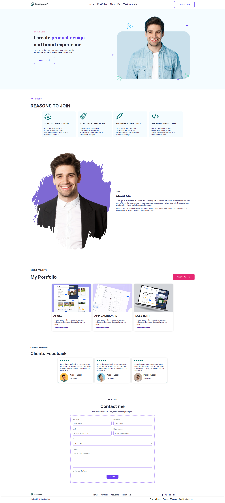

# 🎨 Personal Portfolio Website

A modern, clean, and fully responsive **Personal Portfolio Website** built using
**HTML, CSS, SASS, and JavaScript**. This project focuses on smooth scrolling,
section-based navigation, and a professional UI suitable for designers or
developers.

---

## 🔗 Live Preview

👉 *https://personalwebsites0.netlify.app/*

---

## 📸 Screenshots

  

> 📌 **How to add screenshots**
>
> 1. Create a folder named `Preview`
> 2. Take screenshots of your website
> 3. Rename them (example: `home.png`, `about.png`)
> 4. Put them inside the `Preview` folder

---

## 🚀 Features

- ✅ Fully Responsive (Mobile, Tablet, Desktop)
- ✅ Smooth Scroll Animation
- ✅ Single Page Navigation
- ✅ Home / About / Portfolio / Testimonials / Contact
- ✅ Clean & Modern UI Design
- ✅ Cross-browser Compatible

---

## 🛠️ Technologies Used

- **HTML5**
- **CSS3**
- **SASS / SCSS**
- **JavaScript (Vanilla JS)**

---

---

## 🧭 Navigation (JavaScript)

Smooth scrolling and section navigation handled using JavaScript:

- Home → `#home`
- About → `#about`
- Portfolio → `#portfolio`
- Testimonials → `#testimonials`
- Contact → `#contact`

---

## 🖥️ How to Run Locally

```bash
https://github.com/nillworks/PERSONAL-PORTFOLIO.git
cd PERSONAL-PORTFOLIO
open index.html
```

Or simply open `index.html` in your browser.

---

## 📬 Contact

If you like this project or want to work together:

- 📧 Email: [shiponworks@gmail.com](shiponworks@gmail.com)

---

## 📜 License

This project is open-source and free to use.

---

⭐ **If you like this project, don’t forget to give it a star!**
